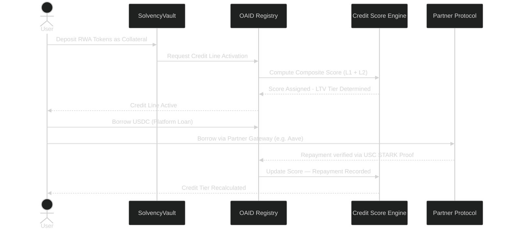
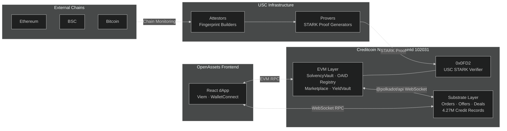

```text
 ________                                  _____                         __
\_____  \ ______   ____   ____           /  _  \   ______ ______  _____/  |_  ______
 /   |   \\____ \_/ __ \ /    \         /  /_\  \ /  ___//  ___/_/ __ \\   __\/  ___/
/    |    \  |_> >  ___/|   |  \       /    |    \\___ \ \___ \ \  ___/|  |  \___ \
\_______  /   __/ \___  >___|  /       \____|__  /____  >____  > \___  >__|  /____  >
        \/|__|        \/     \/                \/     \/     \/      \/          \/
```

<h2 align="center"> T O K E N I Z E &nbsp; • &nbsp; I N V E S T &nbsp; • &nbsp; T R A D E &nbsp; • &nbsp; B O R R O W &nbsp; • &nbsp; E A R N </h2>

<h3 align="center"><em>THE UNIFIED RWA EXECUTION LAYER — POWERED BY CREDITCOIN</em></h3>

---

## Demo Walkthrough

[](https://youtu.be/aWP3_nrwm84)

[](https://youtu.be/aWP3_nrwm84)

**OpenAssets is the unified gateway for Real-World Assets built natively on the Creditcoin blockchain. Tokenize and invest in real-world financial instruments, borrow USDC against RWA collateral with credit-aware terms, access cross-chain credit identity through the Creditcoin protocol, and trade freely in verifiable real value — all from a single execution layer.**

<p align="center">
  
</p>

---

# Why Creditcoin

Creditcoin is a Layer 1 blockchain built for one specific purpose: creating a permanent, tamper-proof record of real-world lending activity on-chain. It stores loan primitives — Orders, Offers, Deals, and Repayments — directly at the blockchain protocol level, not inside a smart contract, not in a company database. These are native chain-level data types, the same way a token balance is native on Ethereum.

As of today, over **4.27 million real-world credit transactions** have been recorded on Creditcoin, representing more than **$80 million in loan value** across **337,000+ borrowers** — primarily across Africa and Southeast Asia. This is real data. Not simulated. Not synthetic.

Creditcoin runs on a hybrid architecture: a Substrate base with a fully EVM-compatible layer on top. The credit history lives on the Substrate layer. OpenAssets smart contracts live on the EVM layer. This distinction is what makes our credit scoring genuinely meaningful.

---

# The Problem: Structural Inefficiencies in RWA Markets

## 1. Opaque and Fragmented Discovery

RWA offerings typically occur through isolated venues or closed systems. This leads to fragmented liquidity, inefficient pricing, and limited market access for both issuers and investors.

## 2. The Static Asset Problem

Once acquired, tokenized RWAs often remain idle until maturity. They cannot be efficiently reused as collateral or composed into other financial strategies without moving across siloed systems.

## 3. Credit History Does Not Travel

Borrowers who repay loans reliably across multiple chains and platforms start from zero every time they arrive at a new protocol. Their financial history is invisible. Every platform treats them as a stranger.

---

# The Solution: OpenAssets on Creditcoin

## 1. Canonical RWA Tokenization

**Standardized, compliant asset representation**

Off-chain financial instruments — invoice receivables, property deeds, trade finance instruments — are transformed into compliant RWA tokens. Each asset follows a deterministic lifecycle with full auditability, transparent ownership, and on-chain verifiability from issuance through settlement.

---

## 2. Hybrid Market Discovery

**Fixed-price listings and uniform-price auctions**

Originators distribute assets through two mechanisms:

* **Static Listings** — fixed-price token sales for immediate, predictable liquidity
* **Uniform-Price Auctions** — fair price discovery where all winning bidders pay the same clearing price

Both mechanisms run natively on Creditcoin EVM, with purchase records and token transfers settled on-chain.

---

## 3. Secondary Market Trading

**Peer-to-peer liquidity for RWA tokens**

After primary acquisition, RWA token holders can trade freely on the built-in secondary market. Buyers and sellers post orders directly against each other, creating continuous price discovery and on-demand exit liquidity for assets that would otherwise be illiquid until maturity.

---

## 4. OAID — Universal Credit Identity on Creditcoin

**Deposit once. Access credit everywhere.**

The Open Access Identity (OAID) is the credit identity layer at the core of OpenAssets. A user deposits their RWA tokens as collateral into the SolvencyVault smart contract and receives an OAID — a on-chain credit line that follows them across every protocol integrated with the Creditcoin network.

Key properties:

* Decoupled collateral custody and credit issuance
* Credit line available across partner protocols without re-depositing collateral
* Unified health factor and liquidation monitoring
* Verifiable solvency readable by any application on-chain



---

## 5. Two-Layer Credit Score — The Creditcoin Advantage

**The same collateral is worth more in the hands of a proven borrower.**

Every user's borrowing terms on OpenAssets are governed by a composite credit score built from two independent sources:

**Layer 1 — Platform Score**
Computed from the user's behaviour on OpenAssets: repayment rate across installments, total USDC repaid, missed payment count, and default history. New users with no platform history receive a neutral baseline of 500.

**Layer 2 — Creditcoin Protocol Score**
Pulled directly from the Creditcoin Substrate chain via `@polkadot/api` RPC connection. This reflects the user's full lending history across every lender and platform that has ever recorded activity on the Creditcoin protocol — 4.27 million real transactions, available to any application reading the chain. A user arriving at OpenAssets for the first time but with a strong Creditcoin protocol history is not treated as a stranger.

**Composite Formula:** `(Layer 1 × 60%) + (Layer 2 × 40%)`
For users with no Substrate history, Layer 1 carries full weight. For first-time platform users, Layer 2 carries full weight.

**Credit Tiers and Applied LTV:**

| Tier | Composite Score | Loan-to-Value |
|---|---|---|
| EXCELLENT | 800 and above | 75% |
| GOOD | 600 to 799 | 70% (standard) |
| FAIR | 400 to 599 | 65% |
| POOR | Below 400 | 55% |

Two users depositing identical collateral will receive different borrowing terms based on their verified credit history. The difference is transparent, on-chain, and attributable to real financial behavior.

<p align="center">
  
</p>

---

## 6. USC — Trustless Cross-Chain Credit Settlement

**A repayment on Ethereum is as valid a credit signal as a repayment on Creditcoin.**

The Universal Smart Contract (USC) is Creditcoin's system for mathematically verifying that a specific transaction happened on another blockchain — without trusting any intermediary. No bridge. No oracle company. Pure cryptographic proof verified on-chain in the same transaction.

**How it works:**

* **Attestors** continuously watch Ethereum, BSC, Bitcoin, and other chains and build cryptographic fingerprints of their complete transaction histories
* **Provers** generate STARK proofs that a specific transaction exists within that fingerprint
* **Your contract** receives the proof and verifies it synchronously through the `0x0FD2` precompile baked into the Creditcoin EVM — if the math checks out, the contract acts immediately in the same transaction, no asynchronous waiting

**What USC enables on OpenAssets:**

| Cross-Chain Event | What USC Does | Effect on Credit Score |
|---|---|---|
| Repay a loan on Aave (Ethereum) | Proves repayment to Creditcoin contract | Score improves, repayment counted |
| Stake RWA tokens on a partner protocol | Proves staking transaction on-chain | Collateral quality recognized cross-platform |
| Default on a partner protocol (BSC) | Proves default event cross-chain | Score penalized, risk reflected accurately |
| Long borrow history on Compound | Proves repayment track record | New user treated as experienced borrower |

The on-chain proof is the report. At no point does OpenAssets rely on a partner protocol to self-report anything.

<p align="center">
  
</p>

---

## 7. Partner Gateway — Borrow from External Protocols

**Your Creditcoin credit identity, used anywhere.**

Through the Partner Gateway, users with an active OAID credit line can access liquidity from integrated external protocols — such as Aave — using their Creditcoin credit identity as the basis for their borrowing terms. The partner protocol respects the credit-adjusted LTV determined by the composite score. After borrowing, any repayment on the partner platform is verifiable back to the Creditcoin contract via USC, updating the user's score automatically.

Partner loans are tracked alongside platform positions in the portfolio, with full repayment visibility and health monitoring.

---

## 8. Time-Weighted Yield Distribution

**Mathematically fair yield attribution across all holders.**

Yield from settled RWA assets is distributed based on duration of ownership. The settlement model burns RWA tokens in exchange for a pro-rata share of USDC deposited by the issuer — ensuring that long-term holders receive their full accrued economic value regardless of whether they transferred tokens before maturity.

---

# System Lifecycle

```mermaid
%%{init: {'theme': 'dark', 'themeVariables': {'primaryColor': '#1e1b4b', 'primaryTextColor': '#e2e8f0', 'primaryBorderColor': '#818cf8', 'lineColor': '#6366f1', 'edgeLabelBackground': '#0f172a'}}}%%
flowchart LR
    A(Issuance) --> B(Discovery)
    B --> C(Acquisition)
    C --> D(Collateral\nDeposit)
    D --> E(OAID\nCredit)
    E --> F(Borrowing)
    F --> G(Cross-Chain\nVerification)
    G --> H(Repayment)
    H --> I(Settlement)
    I --> J(Yield\nDistribution)

    classDef market fill:#1e3a5f,stroke:#60a5fa,color:#dbeafe
    classDef credit fill:#1e1b4b,stroke:#818cf8,color:#e0e7ff
    classDef chain fill:#064e3b,stroke:#34d399,color:#d1fae5
    classDef settle fill:#451a03,stroke:#fb923c,color:#ffedd5

    class A,B,C market
    class D,E,F credit
    class G,H chain
    class I,J settle
```



---

# Infrastructure Layer

OpenAssets operates as a state interpreter coordinating with smart contracts on Creditcoin EVM, Arbitrum, and Stellar, and with the Creditcoin Substrate chain via WebSocket RPC.

Capabilities:

* Real-time state synchronization across EVM and Substrate layers
* Trust-minimized USC proof verification via `0x0FD2` precompile
* Deterministic RWA asset lifecycle management from tokenization to settlement
* Credit score computation across on-platform history and Creditcoin protocol history
* Role-based access for issuers, investors, and administrators



---

# Core Functional Modules

## Issuer Flow

* Asset registration and compliance validation
* Token minting and supply parameterization
* Marketplace listing — fixed-price or auction
* Settlement deposit and yield distribution to holders

## Investor Flow

* Asset discovery across static listings and live auctions
* Direct token purchase and auction bid placement
* Secondary market order creation and fulfillment
* Yield claiming via burn-to-claim settlement model

## Credit Flow

* RWA token deposit into SolvencyVault as collateral
* OAID credit line activation on Creditcoin
* Credit score computation — Layer 1 platform behavior plus Layer 2 Creditcoin protocol history
* Pre-borrow terms preview showing credit-adjusted LTV before commitment
* USDC borrowing with credit-aware loan terms
* Partner protocol borrowing through the Creditcoin credit identity
* Installment repayment tracking and schedule management
* USC cross-chain proof submission for external credit event recognition

## Settlement Flow

* Asset maturity detection
* Settlement USDC deposit by issuer
* Token burn and pro-rata yield distribution
* Position lifecycle closure and collateral release

```mermaid
%%{init: {'theme': 'dark'}}%%
flowchart TD
    subgraph ISS["  ISSUER FLOW  "]
        I1[Register Asset] --> I2[Compliance\nValidation]
        I2 --> I3[Mint RWA Tokens]
        I3 --> I4{List on Market}
        I4 -->|Fixed Price| I5[Static Listing]
        I4 -->|Price Discovery| I6[Uniform-Price\nAuction]
        I5 & I6 --> I7[Settlement\nDeposit]
        I7 --> I8[Yield Distribution\nto Holders]
    end

    subgraph INV["  INVESTOR FLOW  "]
        V1[Discover Assets] --> V2{Acquire}
        V2 -->|Primary Market| V3[Buy / Bid]
        V2 -->|Secondary Market| V4[P2P Order]
        V3 & V4 --> V5[Hold RWA Tokens]
        V5 --> V6[Claim Yield\non Settlement]
    end

    subgraph CRD["  CREDIT FLOW  "]
        C1[Deposit RWA\nCollateral] --> C2[OAID Credit\nLine Activated]
        C2 --> C3{Borrow}
        C3 -->|Platform| C4[USDC Loan]
        C3 -->|External| C5[Partner Protocol\ne.g. Aave]
        C4 & C5 --> C6[Installment\nRepayment]
        C6 --> C7[USC Cross-Chain\nProof Submitted]
        C7 --> C8[Credit Score\nUpdated]
    end
```



---

# Portfolio and Risk Monitoring

The unified dashboard provides complete visibility across all positions and credit activity.

Features:

* Collateralization ratio and health factor monitoring per position
* Platform loans and partner loans displayed side by side with loan source identification
* Credit score dashboard showing composite score, Layer 1 breakdown, and Layer 2 Creditcoin protocol contribution
* Cross-chain event history — every USC-verified event with Creditcoin testnet explorer links
* Repayment schedule tracking with installment status and overdue alerts
* Yield accrual history and claimable settlement amounts
* Real-time credit-adjusted borrowing capacity

---

# Developer Infrastructure

## Prerequisites

* Node.js v20 or above
* npm or pnpm
* EVM-compatible Web3 wallet (MetaMask or equivalent)
* Creditcoin testnet RPC access
* Backend infrastructure running

---

## Installation

```bash
git clone https://github.com/TheOpenAssets/TOA-Client.git
cd TOA-Client
npm install
cp .env.example .env
npm run dev
```

---

## Environment Variables

### Core Infrastructure

| Variable | Description |
|---|---|
| VITE_API_URL | Backend API endpoint |
| VITE_WALLETCONNECT_PROJECT_ID | Wallet connection identifier |
| VITE_USDC_ADDRESS | Settlement asset contract address |

---

### Marketplace

| Variable | Description |
|---|---|
| VITE_PRIMARY_MARKETPLACE | Primary asset issuance and auction contract |
| VITE_SECONDARY_MARKET | Secondary P2P trading contract |
| VITE_YIELD_VAULT | Yield distribution contract |
| VITE_TOKEN_FACTORY | RWA token minting contract |

---

### Credit and Identity

| Variable | Description |
|---|---|
| VITE_IDENTITY_REGISTRY | On-chain identity verification layer |
| VITE_ATTESTATION_REGISTRY | Compliance and asset attestation contract |
| VITE_OAID | Universal credit identity registry (Creditcoin EVM) |
| VITE_SOLVENCY_VAULT | RWA collateral custody contract |
| VITE_SENIOR_POOL | Platform USDC liquidity pool |

---

### Creditcoin Network

| Variable | Description |
|---|---|
| VITE_CREDITCOIN_RPC | Creditcoin EVM RPC endpoint |
| VITE_CREDITCOIN_SUBSTRATE_WS | Creditcoin Substrate WebSocket for protocol score queries |
| VITE_USC_VERIFIER | USCCreditVerifier contract address (chainId 102031) |

---

## Production Build

```bash
npm run build
npm run preview
```

---

# Creditcoin Network Details

| Property | Value |
|---|---|
| Network | Creditcoin Testnet |
| Chain ID | 102031 |
| EVM RPC | `https://rpc.cc3-testnet.creditcoin.network` |
| Substrate WS | `wss://rpc.cc3-testnet.creditcoin.network` |
| Block Explorer | `https://creditcoin-testnet.blockscout.com` |
| USC Precompile | `0x0FD2` |

---

# System Principles

Trustless &nbsp; &nbsp; Credit-Aware &nbsp; &nbsp; Cross-Chain &nbsp; &nbsp; Transparent &nbsp; &nbsp; Composable &nbsp; &nbsp; Fair

---

# Summary

OpenAssets transforms RWAs from static ownership records into programmable, credit-enabled financial primitives — built natively on the only blockchain designed specifically for real-world lending history.

Core capabilities:

* Standardized RWA tokenization with full on-chain auditability
* Fair yield distribution based on time-weighted ownership
* Universal credit identity through the Creditcoin OAID system
* Two-layer credit scoring combining platform behavior and 4.27M real Creditcoin protocol records
* Trustless cross-chain credit settlement via USC and the `0x0FD2` precompile
* Partner protocol access using Creditcoin credit identity as collateral
* Secondary market liquidity for assets that would otherwise be illiquid

The long-term goal is for any borrower anywhere to build a verifiable, portable, tamper-proof financial identity across every platform they use — and carry that identity with them anywhere in DeFi. OpenAssets on Creditcoin is the foundational infrastructure for that world.

---

# Contact

[https://www.openassets.xyz](https://www.openassets.xyz)

---

© 2026 OpenAssets
All rights reserved.
