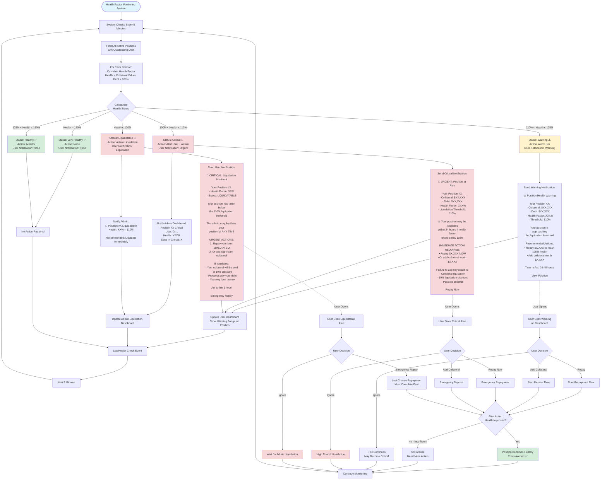

# Solvency Vault - Complete UX Flow Diagram

## Overview
This document contains the complete user experience flow diagrams for the Solvency Vault platform, covering both Investor and Admin journeys, including all edge cases and decision points.

---

## 1. Complete Investor Journey

```mermaid
flowchart TD
    Start([User Visits Platform]) --> Connect[Connect Wallet]
    Connect --> Auth{Wallet<br/>Connected?}

    Auth -->|No| AuthError[Show: Please connect wallet]
    AuthError --> Connect

    Auth -->|Yes| SignChallenge[Sign Authentication Message]
    SignChallenge --> RoleSelect{Select Role}

    RoleSelect -->|Investor| InvestorDash[Investor Dashboard]
    RoleSelect -->|Admin| AdminDash[Admin Dashboard]

    %% INVESTOR MAIN DASHBOARD
    InvestorDash --> DashView{What does<br/>user see?}

    DashView --> CreditSummary[Credit Line Summary<br/>- Total Limit<br/>- Used Amount<br/>- Available Credit]
    DashView --> MyPositions[My Positions List<br/>- Collateral<br/>- Debt<br/>- Health Factor]
    DashView --> ProtocolCards[Partner Protocols<br/>Aave, Compound, etc.]

    %% USER ACTIONS FROM DASHBOARD
    CreditSummary --> UserAction{User Action}
    MyPositions --> UserAction
    ProtocolCards --> UserAction

    UserAction -->|Click Borrow on Protocol| BorrowStart[Start Borrow Flow]
    UserAction -->|View Position| ViewPos[View Position Details]
    UserAction -->|Add Collateral| DepositStart[Start Deposit Flow]
    UserAction -->|Repay Loan| RepayStart[Start Repayment Flow]
    UserAction -->|Withdraw| WithdrawStart[Start Withdrawal Flow]

    %% BORROW FLOW
    BorrowStart --> CheckCredit{Has Available<br/>Credit?}

    CheckCredit -->|Yes, Sufficient| BorrowModal[Borrow Modal Opens<br/>Enter Amount]
    CheckCredit -->|No| InsufficientCreditMsg[Show: Insufficient Collateral<br/>Options:<br/>1. Buy RWA Tokens<br/>2. Upload Private Asset]

    InsufficientCreditMsg --> NeedMoreCollateral{User Choice}
    NeedMoreCollateral -->|Buy Tokens| MarketplaceRedirect[Redirect to Marketplace]
    NeedMoreCollateral -->|Upload Asset| PrivateAssetFlow[Private Asset Submission]

    %% BORROW MODAL
    BorrowModal --> EnterAmount[User Enters Borrow Amount]
    EnterAmount --> ValidateBorrow{Validation Checks}

    ValidateBorrow -->|Amount > Available Credit| BorrowError1[Show: Insufficient credit<br/>Max: $XX,XXX]
    BorrowError1 --> BorrowModal

    ValidateBorrow -->|New Health < 110%| BorrowError2[Show: Would make position<br/>liquidatable<br/>Suggest lower amount]
    BorrowError2 --> BorrowModal

    ValidateBorrow -->|Amount = 0| BorrowError3[Show: Amount must be > 0]
    BorrowError3 --> BorrowModal

    ValidateBorrow -->|Valid| CheckMaturity{Collateral Maturity<br/>vs Loan Period}

    %% MATURITY MISMATCH HANDLING
    CheckMaturity -->|Maturity > Loan Due Date| MaturityModal[Show Maturity Mismatch Modal<br/><br/>Options:<br/>1. Auto-Repay from Yield ✓<br/>2. Manual Repayment]
    CheckMaturity -->|No Mismatch| ProceedBorrow[Calculate New Health Factor]

    MaturityModal --> UserChoice{User Selection}
    UserChoice -->|Auto-Repay| EnableAutoRepay[Enable Auto-Repay Setting]
    UserChoice -->|Manual| AckRisk[User Acknowledges Risk]

    EnableAutoRepay --> ProceedBorrow
    AckRisk --> ProceedBorrow

    ProceedBorrow --> ShowPreview[Show Borrow Preview:<br/>- Amount: $XX,XXX<br/>- New Debt: $XX,XXX<br/>- New Health: XXX%<br/>- Interest: 5% APR]

    ShowPreview --> ConfirmBorrow{User Confirms?}
    ConfirmBorrow -->|No| CancelBorrow[Cancel]
    CancelBorrow --> InvestorDash

    ConfirmBorrow -->|Yes| ExecuteBorrow[Execute On-Chain Transaction<br/>SolvencyVault.borrowUSDC]

    ExecuteBorrow --> BorrowTxStatus{Transaction<br/>Status}

    BorrowTxStatus -->|User Rejects| TxRejected[Show: Transaction cancelled]
    TxRejected --> InvestorDash

    BorrowTxStatus -->|Network Error| TxError[Show: Network error<br/>Try again]
    TxError --> InvestorDash

    BorrowTxStatus -->|Pending >5 min| TxPending[Show: Taking longer than expected<br/>- Check status<br/>- Speed up<br/>- Cancel]
    TxPending --> BorrowTxStatus

    BorrowTxStatus -->|Success| BorrowSuccess[Show Success:<br/>✓ Borrowed $XX,XXX<br/>✓ New Debt: $XX,XXX<br/>✓ Health: XXX%]

    BorrowSuccess --> RefreshDash[Refresh Dashboard Data]
    RefreshDash --> InvestorDash

    %% DEPOSIT FLOW (RWA TOKENS)
    DepositStart --> DepositChoice{Deposit What?}
    DepositChoice -->|RWA Tokens| SelectToken[Select Token from Wallet]
    DepositChoice -->|Private Asset| PrivateAssetFlow

    SelectToken --> CheckBalance{Has Token<br/>Balance?}
    CheckBalance -->|No Balance| NoBalance[Show: No tokens found<br/>Go to Marketplace]
    NoBalance --> MarketplaceRedirect

    CheckBalance -->|Has Balance| EnterDepositAmt[Enter Deposit Amount<br/>Show:<br/>- Balance: XX tokens<br/>- Price: $X.XX per token<br/>- Value: $XX,XXX]

    EnterDepositAmt --> ValidateDeposit{Validation}
    ValidateDeposit -->|Amount > Balance| DepositError1[Show: Insufficient balance]
    DepositError1 --> EnterDepositAmt

    ValidateDeposit -->|Amount = 0| DepositError2[Show: Amount must be > 0]
    DepositError2 --> EnterDepositAmt

    ValidateDeposit -->|Valid| ShowDepositPreview[Show Preview:<br/>- Deposit: XX tokens<br/>- Value: $XX,XXX<br/>- Credit Line: $XX,XXX 70% LTV<br/>☑ Create OAID Credit Line]

    ShowDepositPreview --> ConfirmDeposit{User Confirms?}
    ConfirmDeposit -->|No| CancelDeposit[Cancel]
    CancelDeposit --> InvestorDash

    ConfirmDeposit -->|Yes| CheckAllowance{Token<br/>Approved?}

    CheckAllowance -->|No| ApproveToken[Step 1: Approve Token<br/>Sign Approval Transaction]
    CheckAllowance -->|Yes| DepositTx[Step 2: Deposit Collateral]

    ApproveToken --> ApproveTxStatus{Approval<br/>Status}
    ApproveTxStatus -->|Success| DepositTx
    ApproveTxStatus -->|Failed| ApproveError[Show: Approval failed]
    ApproveError --> InvestorDash

    DepositTx --> ExecuteDeposit[Execute On-Chain:<br/>SolvencyVault.depositCollateral]

    ExecuteDeposit --> DepositTxStatus{Transaction<br/>Status}
    DepositTxStatus -->|Success| DepositSuccess[Parse PositionCreated Event<br/>Get Position ID]
    DepositTxStatus -->|Failed| DepositFailed[Show: Deposit failed]
    DepositFailed --> InvestorDash

    DepositSuccess --> SyncBackend[CRITICAL: Sync with Backend<br/>POST /solvency/sync-position]

    SyncBackend --> SyncStatus{Sync<br/>Success?}
    SyncStatus -->|Yes| FetchCredit[Fetch OAID Credit Line<br/>GET /solvency/oaid/my-credit]
    SyncStatus -->|No| SyncWarning[Show Warning:<br/>Position exists on-chain<br/>but not in backend<br/>Contact support]

    FetchCredit --> ShowDepositSuccess[Show Success:<br/>✓ Position #X Created<br/>✓ Collateral: XX tokens $XX,XXX<br/>✓ Credit Line: $XX,XXX<br/>✓ OAID Active<br/><br/>Next: Borrow or Add More]

    ShowDepositSuccess --> BorrowNow{Borrow<br/>Immediately?}
    BorrowNow -->|Yes| BorrowModal
    BorrowNow -->|No| InvestorDash

    SyncWarning --> InvestorDash

    %% PRIVATE ASSET SUBMISSION
    PrivateAssetFlow --> UploadForm[Private Asset Upload Form<br/>- Asset Name<br/>- Type DEED/BOND/INVOICE<br/>- Location<br/>- Your Valuation Estimate<br/>- Document Upload]

    UploadForm --> UploadDoc[Upload Document to IPFS<br/>Get Document Hash]
    UploadDoc --> SubmitRequest[Submit Request<br/>POST /solvency/private-asset/upload-request]

    SubmitRequest --> RequestSubmitted[Show Success:<br/>✓ Request Submitted<br/>Request ID: XXX<br/>Status: Pending Review<br/>Typical time: 1-3 days]

    RequestSubmitted --> WaitApproval[Wait for Admin Approval<br/>User can check status at:<br/>My Private Asset Requests]

    WaitApproval --> CheckRequestStatus{Check Request<br/>Status}

    CheckRequestStatus --> RequestStatus{Status?}

    RequestStatus -->|Pending| StillWaiting[Still Pending Review<br/>Show: Waiting for admin<br/>Days since submission: X]
    StillWaiting --> WaitApproval

    RequestStatus -->|Approved| RequestApproved[Show Notification:<br/>🎉 Asset Approved!<br/>- Your Value: $XXX,XXX<br/>- Final Value: $XXX,XXX by admin<br/>- Token: DEED-001<br/>- Position #X Created<br/>- Credit Line: $XXX,XXX 60% LTV<br/><br/>You can borrow now!]

    RequestApproved --> AutoDeposited[Note: Token automatically<br/>deposited to vault<br/>No manual deposit needed]
    AutoDeposited --> InvestorDash

    RequestStatus -->|Rejected| RequestRejected[Show Notification:<br/>❌ Asset Rejected<br/>Reason: Admin's reason<br/><br/>Options:<br/>- Submit updated request<br/>- Contact support<br/>- Use RWA tokens instead]

    RequestRejected --> RejectedChoice{User Choice}
    RejectedChoice -->|Resubmit| UploadForm
    RejectedChoice -->|Buy Tokens| MarketplaceRedirect
    RejectedChoice -->|Cancel| InvestorDash

    %% REPAYMENT FLOW
    RepayStart --> SelectPosition[Select Position to Repay]
    SelectPosition --> FetchPositionData[Fetch Position Details<br/>GET /solvency/position/:id]

    FetchPositionData --> ShowDebtInfo[Show Debt Information:<br/>- Principal: $XX,XXX<br/>- Interest: $XXX<br/>- Total Debt: $XX,XXX<br/>- Current Health: XXX%]

    ShowDebtInfo --> EnterRepayAmt[Enter Repayment Amount<br/>Quick options: 25%, 50%, 75%, 100%]

    EnterRepayAmt --> CheckUSDCBalance{Has USDC<br/>Balance?}

    CheckUSDCBalance -->|No| InsufficientUSDC[Show: Insufficient USDC<br/>Your balance: $X,XXX<br/>Need: $XX,XXX]
    InsufficientUSDC --> InvestorDash

    CheckUSDCBalance -->|Yes| CalcNewHealth[Calculate New Health Factor<br/>Show Preview:<br/>- Repaying: $XX,XXX<br/>- New Debt: $X,XXX<br/>- New Health: XXX%]

    CalcNewHealth --> ConfirmRepay{User Confirms?}
    ConfirmRepay -->|No| CancelRepay[Cancel]
    CancelRepay --> InvestorDash

    ConfirmRepay -->|Yes| CheckUSDCAllowance{USDC<br/>Approved?}

    CheckUSDCAllowance -->|No| ApproveUSDC[Step 1: Approve USDC<br/>Sign Approval Transaction]
    CheckUSDCAllowance -->|Yes| RepayTx[Step 2: Repay Loan]

    ApproveUSDC --> ApproveUSDCStatus{Approval<br/>Status}
    ApproveUSDCStatus -->|Success| RepayTx
    ApproveUSDCStatus -->|Failed| ApproveUSDCError[Show: Approval failed]
    ApproveUSDCError --> InvestorDash

    RepayTx --> ExecuteRepay[Execute On-Chain:<br/>SolvencyVault.repayLoan]

    ExecuteRepay --> RepayTxStatus{Transaction<br/>Status}

    RepayTxStatus -->|Success| CheckFullRepay{Debt = 0?}
    RepayTxStatus -->|Failed - Liquidated| PositionLiquidated[Show: Position was liquidated<br/>while repaying<br/>Transaction reverted<br/>No funds deducted]
    PositionLiquidated --> InvestorDash

    RepayTxStatus -->|Failed - Other| RepayFailed[Show: Repayment failed]
    RepayFailed --> InvestorDash

    CheckFullRepay -->|No - Partial| PartialRepaySuccess[Show Success:<br/>✓ Repaid $XX,XXX<br/>- Remaining Debt: $X,XXX<br/>- New Health: XXX%<br/>- Your position is safer!]
    PartialRepaySuccess --> InvestorDash

    CheckFullRepay -->|Yes - Full| FullRepaySuccess[Show Success:<br/>🎉 Loan Fully Repaid!<br/>- Paid: $XX,XXX<br/>- Remaining Debt: $0<br/>- Health: N/A no debt<br/><br/>You can now:<br/>- Withdraw collateral<br/>- Borrow again]

    FullRepaySuccess --> InvestorDash

    %% WITHDRAWAL FLOW
    WithdrawStart --> SelectWithdrawPos[Select Position]
    SelectWithdrawPos --> CheckDebt{Has Outstanding<br/>Debt?}

    CheckDebt -->|Yes| CannotWithdraw[Show Error:<br/>❌ Cannot withdraw<br/>Outstanding debt: $XX,XXX<br/><br/>Please repay loan first]
    CannotWithdraw --> InvestorDash

    CheckDebt -->|No - Debt = 0| EnterWithdrawAmt[Enter Withdrawal Amount<br/>Available: XX tokens<br/>Quick options: 25%, 50%, 75%, 100%]

    EnterWithdrawAmt --> ValidateWithdraw{Validation}
    ValidateWithdraw -->|Amount > Available| WithdrawError[Show: Insufficient collateral]
    WithdrawError --> EnterWithdrawAmt

    ValidateWithdraw -->|Valid| CalcOAIDImpact[Calculate OAID Impact<br/>Show Warning:<br/>⚠️ Withdrawing will reduce<br/>your credit line<br/>- Current: $XX,XXX<br/>- New: $X,XXX<br/>- Reduction: -$X,XXX]

    CalcOAIDImpact --> ConfirmWithdraw{User Confirms?}
    ConfirmWithdraw -->|No| CancelWithdraw[Cancel]
    CancelWithdraw --> InvestorDash

    ConfirmWithdraw -->|Yes| ExecuteWithdraw[Execute On-Chain:<br/>SolvencyVault.withdrawCollateral]

    ExecuteWithdraw --> WithdrawTxStatus{Transaction<br/>Status}

    WithdrawTxStatus -->|Success| CheckFullWithdraw{Withdrew All?}
    WithdrawTxStatus -->|Failed| WithdrawFailed[Show: Withdrawal failed]
    WithdrawFailed --> InvestorDash

    CheckFullWithdraw -->|No - Partial| PartialWithdrawSuccess[Show Success:<br/>✓ Withdrawn: XX tokens $XX,XXX<br/>- Remaining: XX tokens<br/>- New Credit Line: $X,XXX<br/>- Reduction: -$X,XXX]
    PartialWithdrawSuccess --> InvestorDash

    CheckFullWithdraw -->|Yes - All| FullWithdrawSuccess[Show Success:<br/>🎉 Position Closed!<br/>- Withdrawn: XX tokens $XX,XXX<br/>- Position Status: CLOSED<br/>- OAID Credit: Deactivated<br/><br/>Tokens returned to wallet]

    FullWithdrawSuccess --> InvestorDash

    %% POSITION MONITORING & HEALTH ALERTS
    ViewPos --> DisplayPosition[Display Position Details:<br/>- Collateral: XX tokens $XX,XXX<br/>- Debt: $XX,XXX<br/>- Health Factor: XXX%<br/>- Max Borrow: $XX,XXX<br/>- Status: Active/Closed<br/>- OAID Credit: Active/Inactive]

    DisplayPosition --> MonitorHealth{Health Factor<br/>Status}

    MonitorHealth -->|> 150%| HealthyGreen[Show: Healthy ✅<br/>Your position is very safe]
    MonitorHealth -->|125-150%| HealthyCaution[Show: Caution ⚠️<br/>Position is safe but monitor]
    MonitorHealth -->|110-125%| HealthyWarning[Show: Warning ⚠️<br/>Approaching liquidation<br/>Recommend:<br/>- Repay $X,XXX or<br/>- Add collateral]
    MonitorHealth -->|< 110%| HealthyLiquidatable[Show: Liquidatable 🔴<br/>URGENT ACTION REQUIRED<br/>- Repay immediately or<br/>- Risk liquidation]

    HealthyGreen --> InvestorDash
    HealthyCaution --> InvestorDash
    HealthyWarning --> InvestorDash
    HealthyLiquidatable --> UrgentAction{User Action}
    UrgentAction -->|Repay| RepayStart
    UrgentAction -->|Ignore| RiskLiquidation[Position may be liquidated<br/>by admin]
    RiskLiquidation --> InvestorDash

    %% EXTERNAL EVENTS - REVALUATION
    AssetRevaluation[Admin Updates Asset Valuation] -.-> NotifyUser[Send Notification to User]
    NotifyUser --> RevaluationNotif[Show Notification:<br/>⚠️ Collateral Value Updated<br/>- Previous: $XXX,XXX<br/>- New: $XX,XXX<br/>- Change: -$XX,XXX<br/>- New Health: XXX%]

    RevaluationNotif --> CheckNewHealth{New Health<br/>Status}
    CheckNewHealth -->|Still Healthy| RevalOK[Show: Still safe]
    CheckNewHealth -->|Now Warning| RevalWarning[Show: Now at risk<br/>Action recommended]
    CheckNewHealth -->|Now Liquidatable| RevalCritical[Show: CRITICAL<br/>Immediate action required]

    RevalOK --> InvestorDash
    RevalWarning --> InvestorDash
    RevalCritical --> UrgentAction

    %% EXTERNAL EVENTS - LIQUIDATION
    AdminLiquidates[Admin Liquidates Position] -.-> NotifyLiquidation[Send Liquidation Notification]
    NotifyLiquidation --> LiquidationNotif[Show Notification:<br/>⚠️ Position Liquidated<br/>- Position #X<br/>- Collateral Value: $XX,XXX<br/>- Debt: $XX,XXX<br/>- Sale Price: $X,XXX<br/>- Marketplace Listing Created]

    LiquidationNotif --> LiquidationOutcome{Sale Result}

    LiquidationOutcome -->|Shortfall| ShowShortfall[Show:<br/>- Debt: $XX,XXX<br/>- Recovered: $X,XXX<br/>- Shortfall: $X,XXX<br/>Shortfall recorded]

    LiquidationOutcome -->|Excess| ShowExcess[Show:<br/>🎉 Good News!<br/>- Debt: $XX,XXX<br/>- Sale Price: $XX,XXX<br/>- Excess: $XXX<br/>Returned to your wallet]

    ShowShortfall --> InvestorDash
    ShowExcess --> InvestorDash

    style Start fill:#e1f5ff
    style InvestorDash fill:#d4edda
    style BorrowSuccess fill:#d4edda
    style DepositSuccess fill:#d4edda
    style FullRepaySuccess fill:#d4edda
    style FullWithdrawSuccess fill:#d4edda
    style RequestApproved fill:#d4edda
    style HealthyGreen fill:#d4edda

    style BorrowError1 fill:#f8d7da
    style BorrowError2 fill:#f8d7da
    style DepositError1 fill:#f8d7da
    style InsufficientCreditMsg fill:#fff3cd
    style MaturityModal fill:#fff3cd
    style HealthyWarning fill:#fff3cd
    style HealthyLiquidatable fill:#f8d7da
    style LiquidationNotif fill:#f8d7da
    style RequestRejected fill:#f8d7da
    

---

## 2. Admin Journey - Private Asset Management

flowchart TD
    AdminStart([Admin Logs In]) --> AdminDash[Admin Dashboard]

    AdminDash --> AdminView{Admin Views}

    AdminView --> PendingRequests[Pending Private Asset Requests]
    AdminView --> LiquidationDash[Liquidation Dashboard]
    AdminView --> AssetManagement[Private Asset Management]

    %% PENDING REQUESTS
    PendingRequests --> RequestsList[Show Requests List:<br/>- Request ID<br/>- Asset Name<br/>- User Address<br/>- Claimed Valuation<br/>- Submitted Date<br/>- Status]

    RequestsList --> FilterRequests{Filter Options}
    FilterRequests --> FilterByStatus[Status: All/Pending/Approved/Rejected]
    FilterRequests --> FilterByType[Type: All/Deed/Bond/Invoice]
    FilterRequests --> FilterByDate[Date: 7/30/Custom days]

    FilterByStatus --> RequestsList
    FilterByType --> RequestsList
    FilterByDate --> RequestsList

    RequestsList --> SelectRequest{Admin Action}

    SelectRequest -->|View Details| ViewRequestDetail[View Request Details:<br/>- Asset Info<br/>- Location<br/>- Claimed Valuation<br/>- Description<br/>- Requester Info<br/>- KYC Status<br/>- Documents<br/>- Document Hash]

    ViewRequestDetail --> ViewDocuments[View Document on IPFS<br/>Review Asset Quality<br/>Verify Authenticity]

    ViewDocuments --> AdminDecision{Admin Decision}

    AdminDecision -->|Approve| ApprovalForm[Approval Form:<br/>- Enter Final Valuation<br/>- Admin Notes<br/>- Confirm]

    ApprovalForm --> ValidateFinalVal{Validation}
    ValidateFinalVal -->|Valuation = 0| ValError[Show: Valuation must be > 0]
    ValError --> ApprovalForm

    ValidateFinalVal -->|Valid| ConfirmApproval{Admin Confirms?}
    ConfirmApproval -->|No| CancelApproval[Cancel]
    CancelApproval --> AdminDash

    ConfirmApproval -->|Yes| ExecuteApproval[Execute Approval<br/>POST /admin/solvency/private-asset/approve/:id]

    ExecuteApproval --> BackendProcess[Backend Process:<br/>1. Mint PrivateAsset Token<br/>2. Auto-deposit to SolvencyVault<br/>3. Create Position<br/>4. Issue OAID Credit Line 60% LTV<br/>5. Notify User]

    BackendProcess --> ApprovalStatus{Status}
    ApprovalStatus -->|Success| ApprovalSuccess[Show Success:<br/>✓ Asset Approved<br/>✓ Token Minted: DEED-001<br/>✓ Token Address: 0x...<br/>✓ Deposited to Vault<br/>✓ Position #X Created<br/>✓ Credit Line: $XXX,XXX 60% LTV<br/>✓ User Notified<br/><br/>Final Valuation: $XXX,XXX<br/>Mint Tx: 0x...<br/>Deposit Tx: 0x...]

    ApprovalStatus -->|Failed| ApprovalFailed[Show Error:<br/>❌ Approval failed<br/>Reason: error message]

    ApprovalSuccess --> AdminDash
    ApprovalFailed --> AdminDash

    AdminDecision -->|Reject| RejectionForm[Rejection Form:<br/>- Enter Rejection Reason<br/>- Confirm]

    RejectionForm --> ConfirmRejection{Admin Confirms?}
    ConfirmRejection -->|No| CancelRejection[Cancel]
    CancelRejection --> AdminDash

    ConfirmRejection -->|Yes| ExecuteRejection[Execute Rejection<br/>POST /admin/solvency/private-asset/reject/:id]

    ExecuteRejection --> RejectionStatus{Status}
    RejectionStatus -->|Success| RejectionSuccess[Show Success:<br/>✓ Request Rejected<br/>✓ User Notified<br/>Reason: rejection reason]

    RejectionStatus -->|Failed| RejectionFailed[Show Error:<br/>❌ Rejection failed]

    RejectionSuccess --> AdminDash
    RejectionFailed --> AdminDash

    %% LIQUIDATION DASHBOARD
    LiquidationDash --> FetchLiquidatable[Fetch Liquidatable Positions<br/>GET /admin/solvency/liquidatable]

    FetchLiquidatable --> ShowHealthSummary[Show Health Status Summary:<br/>🔴 Critical < 100%: X positions<br/>🟡 Warning 100-110%: X positions<br/>🟢 Healthy > 110%: X positions]

    ShowHealthSummary --> ShowPositions[Show Positions List:<br/>- Position ID<br/>- User Address<br/>- Collateral Value<br/>- Debt<br/>- Health Factor<br/>- Days in Warning<br/>- Recommended Action]

    ShowPositions --> SelectLiqPos{Admin Action}

    SelectLiqPos -->|View Position| ViewPosDetail[View Position Details]
    SelectLiqPos -->|Notify User| SendWarning[Send Warning Notification<br/>to User]
    SelectLiqPos -->|Liquidate| LiquidateConfirm[Liquidation Confirmation Modal]

    SendWarning --> AdminDash
    ViewPosDetail --> AdminDash

    LiquidateConfirm --> ShowLiquidationPreview[Show Preview:<br/>- Position ID<br/>- User Address<br/>- Collateral Value: $XX,XXX<br/>- Debt: $XX,XXX<br/>- Health Factor: XX%<br/><br/>This will:<br/>1. Create marketplace listing<br/>   at 90% value $X,XXX<br/>2. Mark position as LIQUIDATED<br/>3. Notify user<br/>4. On sale: pay SeniorPool<br/>5. Record shortfall if any]

    ShowLiquidationPreview --> ConfirmLiquidation{Admin Confirms?}
    ConfirmLiquidation -->|No| CancelLiquidation[Cancel]
    CancelLiquidation --> AdminDash

    ConfirmLiquidation -->|Yes| ExecuteLiquidation[Execute Liquidation<br/>POST /admin/solvency/liquidate/:id]

    ExecuteLiquidation --> LiquidationTxStatus{Status}

    LiquidationTxStatus -->|Success| LiquidationComplete[Show Success:<br/>✓ Position Liquidated<br/>✓ Listing Created: $X,XXX 10% off<br/>✓ Marketplace ID: 0x...<br/>✓ User Notified<br/>✓ Transaction: 0x...<br/><br/>Expected Shortfall/Excess:<br/>$X,XXX]

    LiquidationTxStatus -->|Failed - Healthy| LiquidateError1[Show Error:<br/>❌ Cannot liquidate<br/>Position is healthy<br/>Health: XXX% > 110%]

    LiquidationTxStatus -->|Failed - Other| LiquidateError2[Show Error:<br/>❌ Liquidation failed<br/>Reason: error]

    LiquidationComplete --> AdminDash
    LiquidateError1 --> AdminDash
    LiquidateError2 --> AdminDash

    %% ASSET VALUATION MANAGEMENT
    AssetManagement --> AssetsList[List All Private Assets:<br/>- Asset ID<br/>- Asset Name<br/>- Token Symbol<br/>- Current Valuation<br/>- Last Updated<br/>- Affected Positions]

    AssetsList --> SelectAsset{Admin Action}
    SelectAsset -->|View Details| ViewAssetDetail[View Asset Details]
    SelectAsset -->|Update Valuation| UpdateValForm[Update Valuation Form]

    ViewAssetDetail --> AdminDash

    UpdateValForm --> ShowCurrentVal[Show Current Valuation:<br/>- Asset: name<br/>- Current Value: $XXX,XXX<br/>- Last Updated: date<br/><br/>Affected Positions: X<br/>- Position #1: Health XXX%<br/>- Position #2: Health XXX%]

    ShowCurrentVal --> EnterNewVal[Enter New Valuation:<br/>- New Value: $___<br/>- Reason for Update]

    EnterNewVal --> CalculateImpact[Calculate Impact on Positions:<br/>Show for each position:<br/>- Position ID<br/>- Old Health: XXX%<br/>- New Health: XXX%<br/>- New Status: Healthy/Warning/Liquidatable]

    CalculateImpact --> ShowImpactWarning{Any Position<br/>Becomes Liquidatable?}

    ShowImpactWarning -->|Yes| WarnLiquidatable[⚠️ WARNING:<br/>Position #X will become LIQUIDATABLE<br/>Health: XXX% → XX% < 110%<br/><br/>User will be notified<br/>Position may need liquidation]

    ShowImpactWarning -->|No| NoImpact[All positions remain healthy]

    WarnLiquidatable --> ConfirmValUpdate{Admin Confirms?}
    NoImpact --> ConfirmValUpdate

    ConfirmValUpdate -->|No| CancelValUpdate[Cancel]
    CancelValUpdate --> AdminDash

    ConfirmValUpdate -->|Yes| ExecuteValUpdate[Execute Update<br/>POST /admin/solvency/private-asset/:id/update-valuation]

    ExecuteValUpdate --> ValUpdateStatus{Status}

    ValUpdateStatus -->|Success| ValUpdateSuccess[Show Success:<br/>✓ Valuation Updated<br/>- Old: $XXX,XXX<br/>- New: $XXX,XXX<br/>- Change: -$XX,XXX<br/><br/>Affected Positions: X<br/>✓ Users Notified<br/><br/>Position Health Updated:<br/>- Position #1: XXX%<br/>- Position #2: XX% ⚠️]

    ValUpdateStatus -->|Failed| ValUpdateFailed[Show Error:<br/>❌ Update failed]

    ValUpdateSuccess --> AdminDash
    ValUpdateFailed --> AdminDash

    style AdminStart fill:#e1f5ff
    style AdminDash fill:#d4edda
    style ApprovalSuccess fill:#d4edda
    style RejectionSuccess fill:#d4edda
    style LiquidationComplete fill:#d4edda
    style ValUpdateSuccess fill:#d4edda

    style ApprovalFailed fill:#f8d7da
    style RejectionFailed fill:#f8d7da
    style LiquidateError1 fill:#f8d7da
    style LiquidateError2 fill:#f8d7da
    style ValUpdateFailed fill:#f8d7da

    style WarnLiquidatable fill:#fff3cd
    style ShowImpactWarning fill:#fff3cd
---

## 3. Edge Cases & Special Scenarios Flow

flowchart TD
    EdgeCases([Edge Cases & Special Scenarios]) --> ScenarioType{Scenario Type}

    %% TRANSACTION EDGE CASES
    ScenarioType -->|Transaction Issues| TxIssues[Transaction Edge Cases]

    TxIssues --> TxScenario{Scenario}

    TxScenario -->|Pending > 10 min| LongPending[Show:<br/>⚠️ Transaction Taking Long<br/>Current: Pending 10+ min<br/><br/>Possible reasons:<br/>- Network congestion<br/>- Gas price too low<br/>- Validator issues<br/><br/>Options:<br/>- Check Status refresh<br/>- Speed Up gas<br/>- Cancel transaction<br/>- Contact Support]

    TxScenario -->|User Rejects Wallet| UserRejects[Show:<br/>Transaction Cancelled<br/>You rejected the transaction<br/>in your wallet]

    TxScenario -->|Insufficient Gas| NoGas[Show:<br/>❌ Insufficient Funds for Gas<br/>You need MNT for transaction fees<br/>Current balance: X MNT<br/>Required: ~X MNT<br/><br/>Please add MNT to wallet]

    TxScenario -->|Network Error| NetworkErr[Show:<br/>❌ Network Error<br/>Connection failed<br/><br/>Please check:<br/>- Internet connection<br/>- RPC endpoint status<br/>- Try again later]

    LongPending --> ReturnDash[Return to Dashboard]
    UserRejects --> ReturnDash
    NoGas --> ReturnDash
    NetworkErr --> ReturnDash

    %% MULTIPLE POSITIONS
    ScenarioType -->|Multiple Positions| MultiPos[Multiple Positions Same User]

    MultiPos --> ShowAllPositions[Show All Positions:<br/><br/>Position #5 - INVOICE-001 RWA<br/>- Collateral: $76,500<br/>- Debt: $50,000<br/>- Health: 153% ✅<br/>- Credit: $53,550 70% LTV<br/><br/>Position #8 - DEED-001 Private<br/>- Collateral: $450,000<br/>- Debt: $270,000<br/>- Health: 167% ✅<br/>- Credit: $270,000 60% LTV<br/><br/>Combined OAID Credit:<br/>- Total Limit: $323,550<br/>- Total Used: $320,000<br/>- Available: $3,550<br/>- Utilization: 98.90%]

    ShowAllPositions --> MultiPosAction{User Action}
    MultiPosAction -->|Manage Pos 1| ManagePos1[Focus on Position #5]
    MultiPosAction -->|Manage Pos 2| ManagePos2[Focus on Position #8]
    MultiPosAction -->|View Combined| ViewCombined[View Combined Dashboard]

    ManagePos1 --> ReturnDash
    ManagePos2 --> ReturnDash
    ViewCombined --> ReturnDash

    %% ZERO DEBT POSITION
    ScenarioType -->|Zero Debt Position| ZeroDebt[Position with No Debt]

    ZeroDebt --> ShowZeroDebt[Show Position:<br/>- Collateral: XX tokens $XX,XXX<br/>- Debt: $0<br/>- Health Factor: N/A no debt<br/>- Status: ACTIVE<br/>- Available to Borrow: $XX,XXX<br/><br/>Options:<br/>✓ Borrow USDC enabled<br/>✓ Withdraw enabled no repay needed<br/>✓ Add More Collateral]

    ShowZeroDebt --> ZeroDebtAction{User Action}
    ZeroDebtAction -->|Borrow| StartBorrow[Start Borrow Flow]
    ZeroDebtAction -->|Withdraw| StartWithdraw[Start Withdrawal Flow]
    ZeroDebtAction -->|Add More| StartDeposit[Start Deposit Flow]

    StartBorrow --> ReturnDash
    StartWithdraw --> ReturnDash
    StartDeposit --> ReturnDash

    %% OVER-BORROWED DUE TO INTEREST
    ScenarioType -->|Over-Borrowed| OverBorrowed[Over-Borrowed Due to Interest]

    OverBorrowed --> ShowOverBorrowed[Show Position:<br/>- Collateral Value: $76,500<br/>- Max Borrow: $53,550 70% LTV<br/>- Borrowed Principal: $53,550<br/>- Interest Accrued: $41.10<br/>- Total Debt: $53,591.10<br/>- Remaining Capacity: $0<br/>  over by $41.10<br/>- Health: 142% Still Healthy<br/><br/>ℹ️ Info:<br/>You've reached your borrowing limit<br/>Interest pushed debt over LTV<br/>Repay some debt to borrow more]

    ShowOverBorrowed --> OverBorrowAction{User Action}
    OverBorrowAction -->|Try to Borrow| BorrowDisabled[Show:<br/>❌ Borrow Disabled<br/>Remaining capacity: $0<br/>Please repay first]
    OverBorrowAction -->|Repay| StartRepay[Start Repayment Flow]

    BorrowDisabled --> ReturnDash
    StartRepay --> ReturnDash

    %% PARTIAL WITHDRAWAL
    ScenarioType -->|Partial Withdrawal| PartialWithdraw[Partial Collateral Withdrawal]

    PartialWithdraw --> ShowPartialWithdraw[Show Withdrawal Impact:<br/><br/>Withdrawing: 22.5 tokens 25%<br/><br/>Before:<br/>- Collateral: 90 tokens $76,500<br/>- Credit Line: $53,550<br/><br/>After:<br/>- Collateral: 67.5 tokens $57,375<br/>- Credit Line: $40,163<br/>- Reduction: -$13,387<br/><br/>⚠️ Warning:<br/>Your OAID credit line will decrease<br/>You'll be able to borrow less<br/>Position remains ACTIVE]

    ShowPartialWithdraw --> PartialWithdrawConfirm{User Confirms?}
    PartialWithdrawConfirm -->|Yes| ExecutePartialWithdraw[Execute Withdrawal]
    PartialWithdrawConfirm -->|No| CancelPartialWithdraw[Cancel]

    ExecutePartialWithdraw --> PartialWithdrawSuccess[Show Success:<br/>✓ Withdrawn: 22.5 tokens<br/>✓ Remaining: 67.5 tokens<br/>✓ New Credit Line: $40,163<br/>✓ Position Still Active<br/><br/>You can withdraw more anytime]

    PartialWithdrawSuccess --> ReturnDash
    CancelPartialWithdraw --> ReturnDash

    %% LIQUIDATION DURING REPAYMENT
    ScenarioType -->|Liquidation During Action| LiquidationRace[Liquidation During Repayment]

    LiquidationRace --> UserStartsRepay[User Starts Repayment<br/>Transaction Pending]
    UserStartsRepay --> AdminLiquidates[Admin Liquidates Position<br/>While Tx Pending]
    AdminLiquidates --> RepayTxConfirms[Repayment Tx Confirms]

    RepayTxConfirms --> RepayFails[Transaction Fails:<br/>Position Already Liquidated]

    RepayFails --> ShowLiquidationMsg[Show:<br/>❌ Repayment Failed<br/><br/>Your position was liquidated<br/>while your transaction was processing<br/><br/>✓ Your transaction reverted<br/>✓ No funds deducted<br/>✓ USDC still in wallet<br/><br/>Position Status: LIQUIDATED<br/>Time: timestamp_value<br/><br/>View Liquidation Details]

    ShowLiquidationMsg --> ReturnDash

    %% ASSET REVALUATION IMPACT
    ScenarioType -->|Revaluation Impact| Revaluation[Asset Revaluation]

    Revaluation --> AdminUpdatesVal[Admin Updates Asset Valuation]
    AdminUpdatesVal --> CalcHealthChange[Calculate Health Factor Change]

    CalcHealthChange --> HealthChangeScenario{Health Change}

    HealthChangeScenario -->|Remains Healthy| StillHealthy[Show Notification:<br/>ℹ️ Collateral Value Updated<br/>- Previous: $500,000<br/>- New: $480,000<br/>- Change: -$20,000 -4%<br/><br/>Your Position:<br/>- Health: 160% → 153%<br/>- Status: Still Healthy ✅<br/><br/>No action needed]

    HealthChangeScenario -->|Becomes Warning| BecomesWarning[Show Notification:<br/>⚠️ Collateral Value Dropped<br/>- Previous: $500,000<br/>- New: $350,000<br/>- Change: -$150,000 -30%<br/><br/>Your Position:<br/>- Health: 167% → 117%<br/>- Status: WARNING ⚠️<br/><br/>Recommended Action:<br/>- Repay $XX,XXX or<br/>- Add collateral<br/>to avoid liquidation risk]

    HealthChangeScenario -->|Becomes Liquidatable| BecomesLiquidatable[Show Notification:<br/>🔴 URGENT: Value Dropped<br/>- Previous: $500,000<br/>- New: $320,000<br/>- Change: -$180,000 -36%<br/><br/>Your Position:<br/>- Health: 167% → 107%<br/>- Status: LIQUIDATABLE 🔴<br/><br/>⚠️ IMMEDIATE ACTION REQUIRED<br/>Your position may be liquidated!<br/><br/>Options:<br/>- Repay $30,000 now<br/>- Add more collateral<br/><br/>Act within 24 hours]

    StillHealthy --> ReturnDash
    BecomesWarning --> RevalAction{User Action}
    BecomesLiquidatable --> UrgentAction{User Action}

    RevalAction -->|Repay| StartRepayFlow[Start Repayment]
    RevalAction -->|Add Collateral| StartDepositFlow[Start Deposit]
    RevalAction -->|Ignore| MonitorPosition[Continue Monitoring]

    UrgentAction -->|Repay Now| StartRepayNow[Start Repayment URGENT]
    UrgentAction -->|Add Collateral| StartDepositNow[Start Deposit URGENT]
    UrgentAction -->|Ignore| RiskLiquidation[Risk Liquidation in 24h]

    StartRepayFlow --> ReturnDash
    StartDepositFlow --> ReturnDash
    MonitorPosition --> ReturnDash
    StartRepayNow --> ReturnDash
    StartDepositNow --> ReturnDash
    RiskLiquidation --> ReturnDash

    %% OAID NOT CREATED
    ScenarioType -->|OAID Issues| OAIDMissing[OAID Credit Line Not Created]

    OAIDMissing --> ShowOAIDWarning[Show Warning:<br/>⚠️ OAID Credit Line Not Active<br/><br/>Your Position #X:<br/>- Collateral: XX tokens $XX,XXX<br/>- Status: ACTIVE ✓<br/>- OAID: ❌ Not Active<br/><br/>Impact:<br/>- Can borrow directly on this platform ✓<br/>- Cannot borrow on partner protocols ❌<br/>  Aave, Compound unavailable<br/><br/>Options:<br/>- Create OAID Credit Line<br/>- Continue without OAID]

    ShowOAIDWarning --> OAIDAction{User Choice}
    OAIDAction -->|Create OAID| CreateOAID[Execute:<br/>POST /solvency/position/:id/create-oaid]
    OAIDAction -->|Skip| SkipOAID[Continue Without OAID]

    CreateOAID --> OAIDCreated[Show Success:<br/>✓ OAID Credit Line Created<br/>- Credit Limit: $XX,XXX<br/>- Partner Protocols: Enabled<br/><br/>You can now borrow on:<br/>- Aave<br/>- Compound<br/>- Other partners]

    OAIDCreated --> ReturnDash
    SkipOAID --> ReturnDash

    %% LIQUIDATION WITH EXCESS
    ScenarioType -->|Liquidation Outcome| LiquidationOutcome[Liquidation with Excess Proceeds]

    LiquidationOutcome --> PositionLiquidated[Position Liquidated<br/>Listed at $6,300 90% discount]
    PositionLiquidated --> AssetSold[Asset Sold for $6,800]

    AssetSold --> CompareDebt{Sale Price vs Debt}

    CompareDebt -->|Sale > Debt| ExcessProceeds[Calculation:<br/>- Sale Price: $6,800<br/>- Outstanding Debt: $6,500<br/>- Excess: $300]

    CompareDebt -->|Sale < Debt| Shortfall[Calculation:<br/>- Sale Price: $6,300<br/>- Outstanding Debt: $7,500<br/>- Shortfall: $1,200]

    ExcessProceeds --> ShowExcessNotif[Show Notification:<br/>⚠️ Position Liquidated<br/><br/>Liquidation Details:<br/>- Collateral Value: $7,000<br/>- Your Debt: $6,500<br/>- Sale Price: $6,800<br/><br/>🎉 Good News!<br/>Your collateral sold for MORE<br/>than your debt!<br/><br/>✓ Debt Paid: $6,500<br/>💰 Excess Returned: $300<br/><br/>The $300 has been transferred<br/>to your wallet<br/><br/>Transaction: 0x...]

    Shortfall --> ShowShortfallNotif[Show Notification:<br/>⚠️ Position Liquidated<br/><br/>Liquidation Details:<br/>- Collateral Value: $7,000<br/>- Your Debt: $7,500<br/>- Sale Price: $6,300<br/><br/>Debt Recovery:<br/>✓ Recovered: $6,300<br/>❌ Shortfall: $1,200<br/><br/>The shortfall has been recorded<br/>No additional payment required<br/><br/>Transaction: 0x...]

    ShowExcessNotif --> ReturnDash
    ShowShortfallNotif --> ReturnDash

    %% ADMIN REJECTS AFTER LONG WAIT
    ScenarioType -->|Delayed Rejection| DelayedReject[Admin Rejects After 2 Weeks]

    DelayedReject --> ShowDelayedRejectNotif[Show Notification:<br/>❌ Private Asset Request Rejected<br/><br/>Asset: 123 Main St Property Deed<br/>Request ID: a1b2c3d4...<br/><br/>Timeline:<br/>- Submitted: Jan 4, 2026<br/>- Reviewed: Jan 18, 2026<br/>- Wait Time: 14 days<br/><br/>Rejection Reason:<br/>'Insufficient documentation provided.<br/>Please submit certified appraisal.'<br/><br/>What You Can Do:<br/>1. Submit Updated Request<br/>   with additional docs<br/>2. Contact Support<br/>   for clarification<br/>3. Use RWA Tokens Instead<br/>   from marketplace]

    ShowDelayedRejectNotif --> DelayedRejectAction{User Choice}
    DelayedRejectAction -->|Resubmit| ResubmitRequest[Resubmit with Docs]
    DelayedRejectAction -->|Contact Support| ContactSupport[Open Support Ticket]
    DelayedRejectAction -->|Buy Tokens| GoToMarketplace[Go to Marketplace]

    ResubmitRequest --> ReturnDash
    ContactSupport --> ReturnDash
    GoToMarketplace --> ReturnDash

    ReturnDash --> End([End])

    style EdgeCases fill:#e1f5ff
    style ReturnDash fill:#d4edda
    style PartialWithdrawSuccess fill:#d4edda
    style OAIDCreated fill:#d4edda
    style ExcessProceeds fill:#d4edda

    style LongPending fill:#fff3cd
    style NoGas fill:#f8d7da
    style NetworkErr fill:#f8d7da
    style BorrowDisabled fill:#fff3cd
    style BecomesWarning fill:#fff3cd
    style BecomesLiquidatable fill:#f8d7da
    style ShowLiquidationMsg fill:#f8d7da
    style Shortfall fill:#f8d7da
---

## 4. Health Factor Monitoring Flow



---

## Summary

This comprehensive UX flow diagram covers:

### Investor Journey (Diagram 1)
- ✅ Complete authentication flow
- ✅ Dashboard view with all information
- ✅ Borrow flow with credit checks
- ✅ Insufficient collateral handling
- ✅ Private asset submission and approval
- ✅ RWA token deposit with all steps
- ✅ Maturity mismatch detection and handling
- ✅ Repayment process (partial and full)
- ✅ Withdrawal process with OAID impact
- ✅ Position monitoring and health alerts
- ✅ Revaluation notifications
- ✅ Liquidation notifications

### Admin Journey (Diagram 2)
- ✅ Private asset request review
- ✅ Approval process (auto-minting + deposit + OAID)
- ✅ Rejection process with notifications
- ✅ Liquidation dashboard monitoring
- ✅ Position liquidation execution
- ✅ Asset valuation updates
- ✅ Impact calculation on positions

### Edge Cases (Diagram 3)
- ✅ Transaction issues (pending, rejected, gas, network)
- ✅ Multiple positions per user
- ✅ Zero debt positions
- ✅ Over-borrowed due to interest
- ✅ Partial withdrawals
- ✅ Liquidation during other operations
- ✅ Asset revaluation impacts
- ✅ OAID not created scenarios
- ✅ Liquidation with excess/shortfall
- ✅ Delayed admin decisions

### Health Monitoring (Diagram 4)
- ✅ Automated health factor monitoring
- ✅ Categorization (Very Healthy → Liquidatable)
- ✅ Progressive warning system
- ✅ User notifications at each level
- ✅ Admin alerts for critical positions
- ✅ User response flows
- ✅ Health improvement tracking

All diagrams are non-technical, user-friendly, and cover every decision point and edge case from the frontend integration guide!
